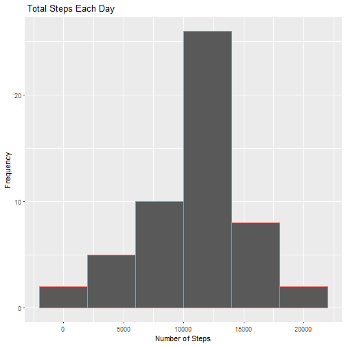
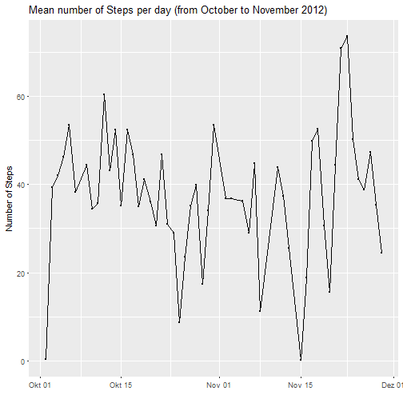
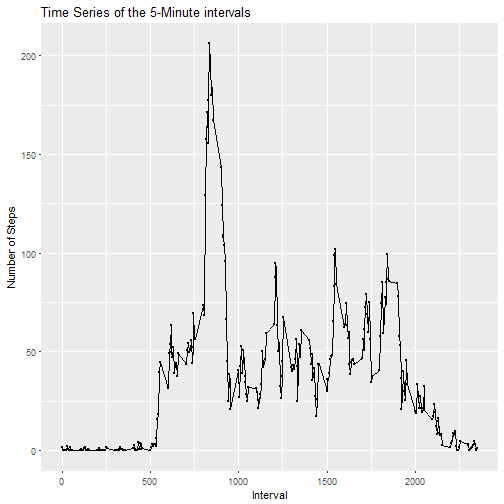
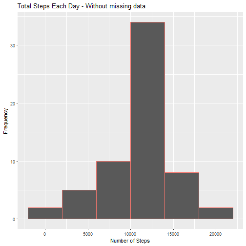
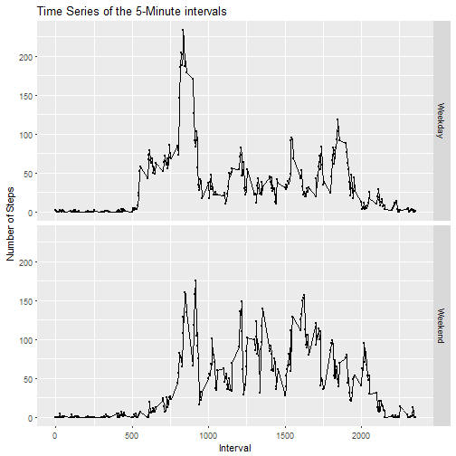

It is now possible to collect a large amount of data about personal movement using activity monitoring devices such as a Fitbit, Nike Fuelband, or Jawbone Up. These type of devices are part of the "quantified self" movement - a group of enthusiasts who take measurements about themselves regularly to improve their health, to find patterns in their behavior, or because they are tech geeks. But these data remain under-utilized both because the raw data are hard to obtain and there is a lack of statistical methods and software for processing and interpreting the data.

The variables included in the given dataset ("Acticity.csv") are:

- steps: Number of steps taking in a 5-minute interval (missing   values are coded as NA)

- date: The date on which the measurement was taken in   
  YYYY-MM-DD format
  
- interval: Identifier for the 5-minute interval in which 
  measurement was taken
  
The dataset is stored in a comma-separated-value (CSV) file and there are a total of 17,568 observations in this dataset.


### The Code for reading in the dataset and/or processing the data is the following:


```r
if(!file.exists("activity.csv")){
  unzip("activity.zip")
}

activitydata <- read.csv2("activity.csv", header = TRUE, sep = ",")
```

### What is mean total number of steps taken per day?

The Histogram of the total number of steps taken each day will be shown in the following. But first I have to sum the steps per day and save the results in a data frame called stepsperday. 


```r
library(ggplot2)

stepsperday <- aggregate(steps~date, activitydata, sum)

ggplot(stepsperday, aes(steps)) + geom_histogram(binwidth = 4000, aes(col = "red")) + ggtitle(label = " Total Steps Each Day") + xlab("Number of Steps") + ylab("Frequency")+ theme(legend.position = "none")
```



The Mean and median number of steps taken each day are estimated in the following:


```r
mean(stepsperday$steps, na.rm = TRUE)
```

```
## [1] 10766.19
```

```r
median(stepsperday$steps)
```

```
## [1] 10765
```

According to the data 10766.19 steps were taken during a day. Furthermore 50% did 10765 steps.


### What is the average daily activity pattern?

1. Plot a time series of the average number of steps taken.To plot the average as a data frame, I have to convert the    data from the data with the `lubridate` package to the date format. Make a time series plot (i.e. type = "l") of the 5-minute interval (x-axis) and the average number of steps taken, averaged across all days (y-axis)
   

```r
library(lubridate)

meanstepsperday <- aggregate(steps ~ date, activitydata, mean)

meanstepsperday$date <-  ymd(meanstepsperday$date)

ggplot(meanstepsperday, aes(date, steps)) + geom_point(size = 0.5) + geom_line(group = 1) + scale_x_date() + xlab("") + ylab("Number of Steps") + ggtitle("Mean number of Steps per day (from October to November 2012)")
```



```r
meanintervals <- aggregate(steps ~ interval, activitydata, mean)

ggplot(meanintervals, aes(interval, steps)) + geom_point(size = 0.5) + geom_line(group = 1) + ggtitle("Time Series of the 5-Minute intervals") + xlab("Interval") + ylab("Number of Steps")
```



2. The 5-minute interval that, on average, contains the    
maximum number of steps is estimated by subsetting.


```r
meanintervals[which.max(meanintervals$steps),]
```

```
##     interval    steps
## 104      835 206.1698
```

### 3. Imputing missing values

Note that there are a number of days/intervals where there are missing values (coded as NA). The presence of missing days may introduce bias into some calculations or summaries of the data.

1. Calculate and report the total number of missing values in the dataset (i.e. the total number of rows with NAs.


```r
library(dplyr)
table(is.na(activitydata))
```

```
## 
## FALSE  TRUE 
## 50400  2304
```

As we see, 2304 TRUE matches can be interpretated as 2304 missing values. 

2. Devise a strategy for filling in all of the missing values in the dataset. The strategy does not need to be sophisticated. Herefore I will use two functions of the `zoo`-package: nameley `ave()` and `na.aggregate`. By Using the first function I am able to find the mean of a x-value by the category of the intervals. The second function 

3. Create a new dataset that is equal to the original dataset but with the missing data filled in.


```r
library(zoo)
completeactivity <- activitydata
completeactivity$steps <-  ave(activitydata$steps, completeactivity$interval, FUN = na.aggregate)
```


4. Make a histogram of the total number of steps taken each day and Calculate and report the mean and median total number of steps taken per day. 


```r
completestepsperday <- aggregate(steps~date, completeactivity, sum)

ggplot(completestepsperday, aes(steps)) + geom_histogram(binwidth = 4000, aes(col = "red")) + ggtitle(label = "Total Steps Each Day - Without missing data") + xlab("Number of Steps") + ylab("Frequency")+ theme(legend.position = "none")
```



The mean of the complete data set is:


```r
mean(completestepsperday$steps)
```

```
## [1] 10766.19
```

The median of the complete data set is:


```r
median(completestepsperday$steps)
```

```
## [1] 10766.19
```


Do these values differ from the estimates from the first part of the assignment? First I will compare the mean of the data.


```r
nonsum <- mean(stepsperday$steps, na.rm = TRUE)
csum <- mean(completestepsperday$steps)

nonsum == csum
```

```
## [1] TRUE
```

Since I used the mean of the correspondnig Intervall, adding new data does not bias the mean. The median however has to increase, since there are 5 more rows in the new dataset. 


```r
noncmed <- median(stepsperday$steps)
cmed <- median(completestepsperday$steps)

noncmed == cmed
```

```
## [1] FALSE
```

```r
cmed - noncmed
```

```
## [1] 1.188679
```

The difference in this case  is one step and in the context of the research low. 

### Are there differences in activity patterns between weekdays and weekends?

For this part the `weekdays()` function may be of some help here. Use the dataset with the filled-in missing values for this part.


```r
library(plyr)

activitydata$date <-  ymd(activitydata$date)

activitydata$weekdays <- weekdays(activitydata$date)

activitydata$weekday.type <- ifelse(activitydata$weekdays == "Sonntag" | activitydata$weekdays == "Samstag", "Weekend", "Weekday")

activitydata$weekday.type <-   as.factor(activitydata$weekday.type)

weekdayintervals <- aggregate(steps ~ interval, subset = activitydata$weekday.type == "Weekday", activitydata, mean)
weekdayintervals <-  aggregate(steps ~ interval, subset = activitydata$weekday.type == "Weekday", activitydata, mean)

groupedby <- ddply(activitydata, ~interval + weekday.type, summarise, steps = mean(steps, na.rm = TRUE))

ggplot(groupedby, aes(interval, steps)) + geom_point(size = 0.5) + geom_line(group = 1) + ggtitle("Time Series of the 5-Minute intervals") + xlab("Interval") + ylab("Number of Steps") + facet_grid(weekday.type~.)
```




